Portfolio Alexandr Malyutin
===========================

# Rendering

## Interactive snow [[link](https://x.com/alexmalyutindev/status/1841541664277475583)]
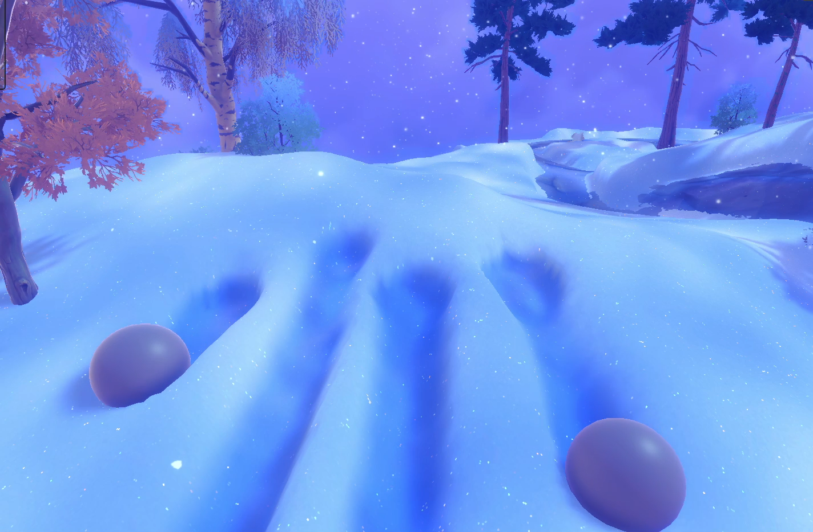

## Geometry Terrain Blend 
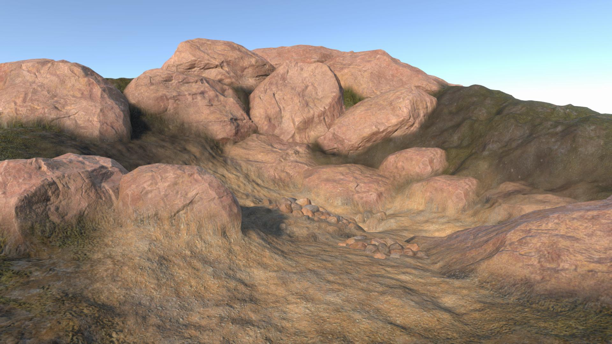

## Triplanar Terrain Mapping [[link](https://x.com/alexmalyutindev/status/1859205873580622301)]

## High based Terrain Maps Blend
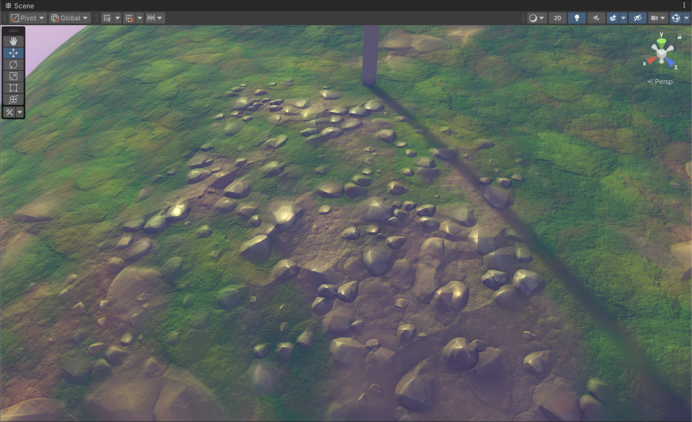

## Parallax Occlusion Mapping
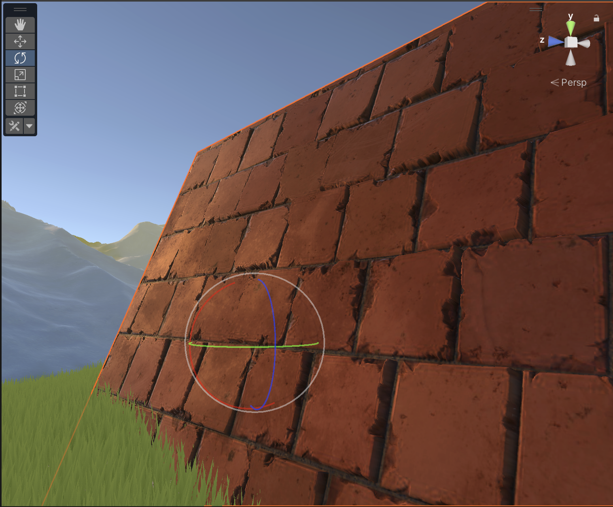

## Parallax Occlusion Mapping Decals [[link](https://x.com/alexmalyutindev/status/1845736017568903455)]

| 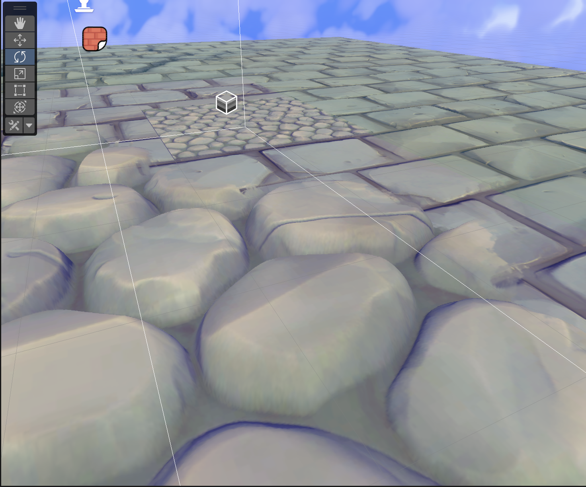 | 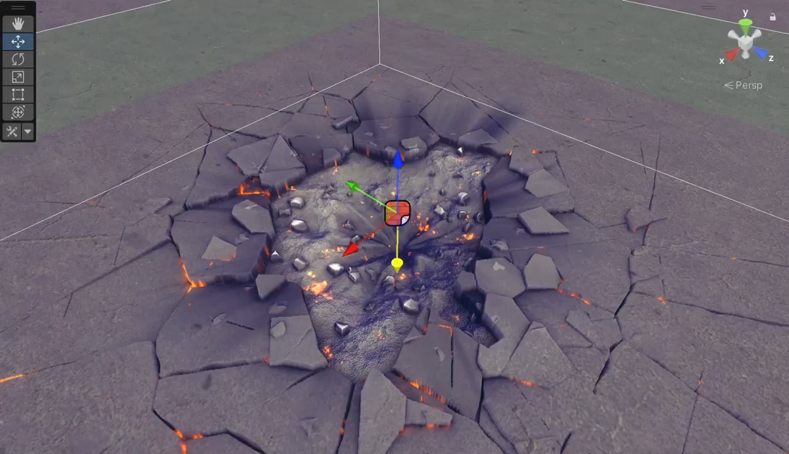 |
| :--------------------------: | :--------------------------: |

## Foliage Translucency [[link](https://x.com/alexmalyutindev/status/1855704297050116353)]
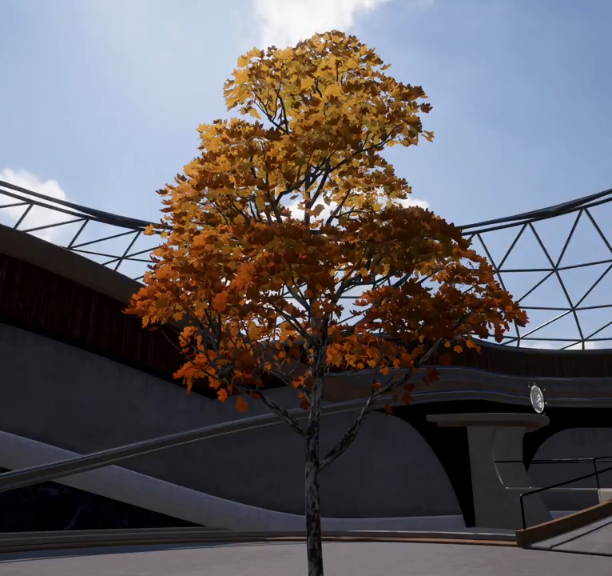

## Voxel based GI [[link](https://x.com/alexmalyutindev/status/1759652466277151195)]
| 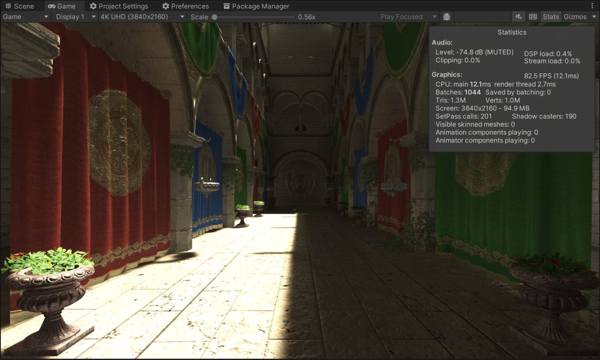 | 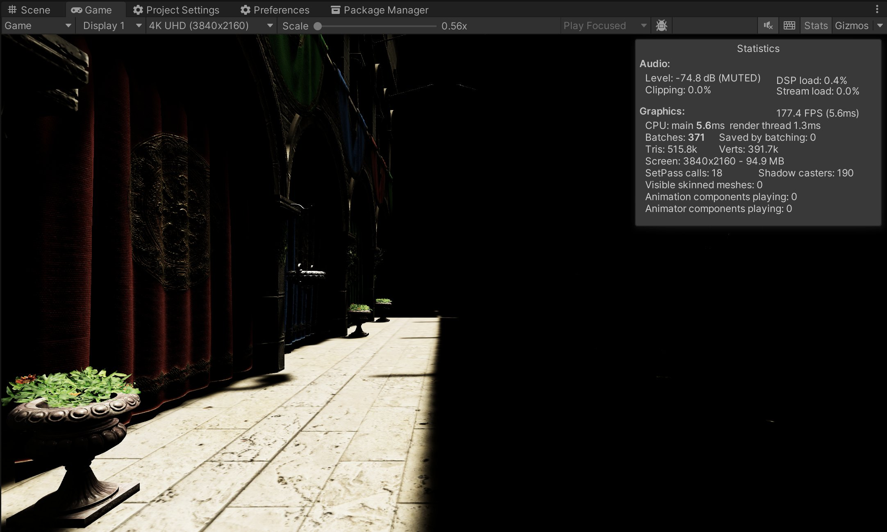 |
| :---------------------: | :---------------------: |
|           On            |           Off           |

## Radiance Cascades GI [[link](https://x.com/alexmalyutindev/status/1862402458569359714)]

| 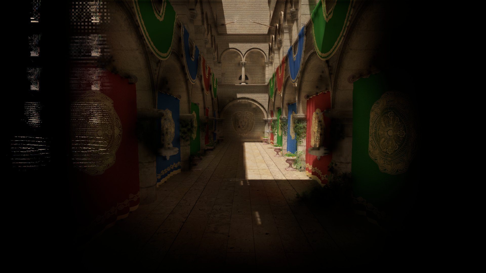 | 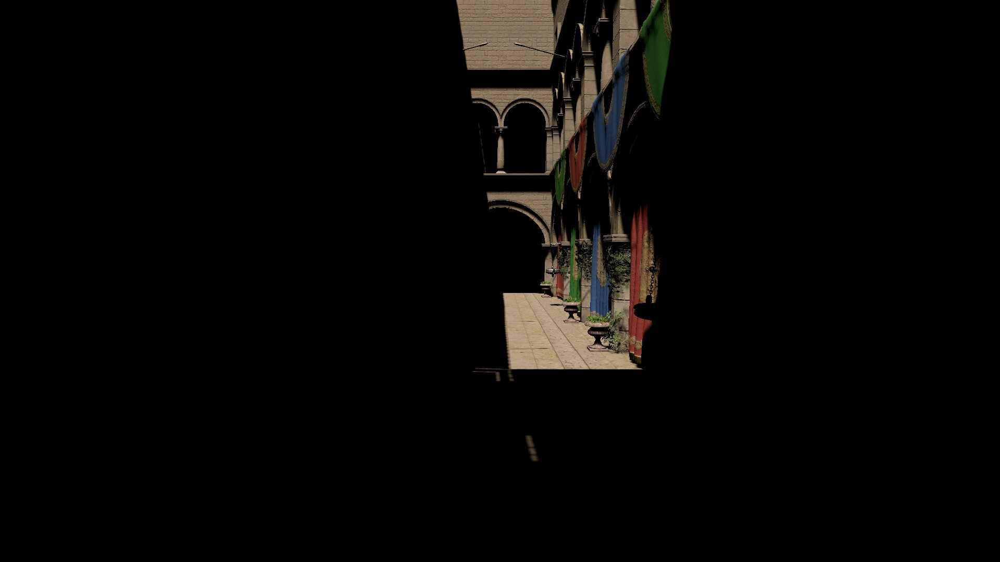 |
| :----------------------------------: | :----------------------------------: |
|                  On                  |                 Off                  |

## 6-Way Lighting Skybox Clouds
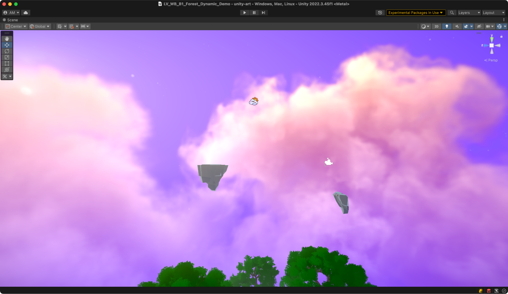

## Ice Refraction
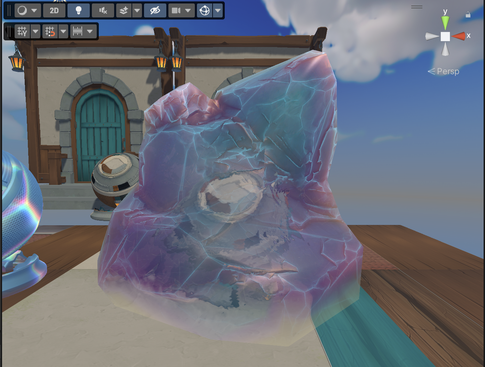

## Volumetric Clouds
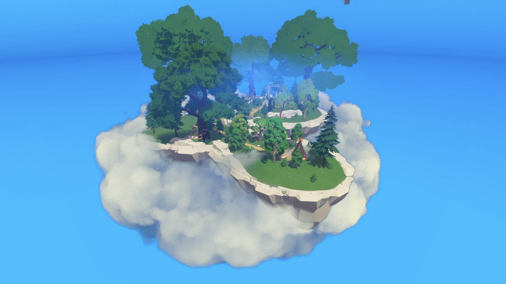

## SunShafts & Volumetric Fog
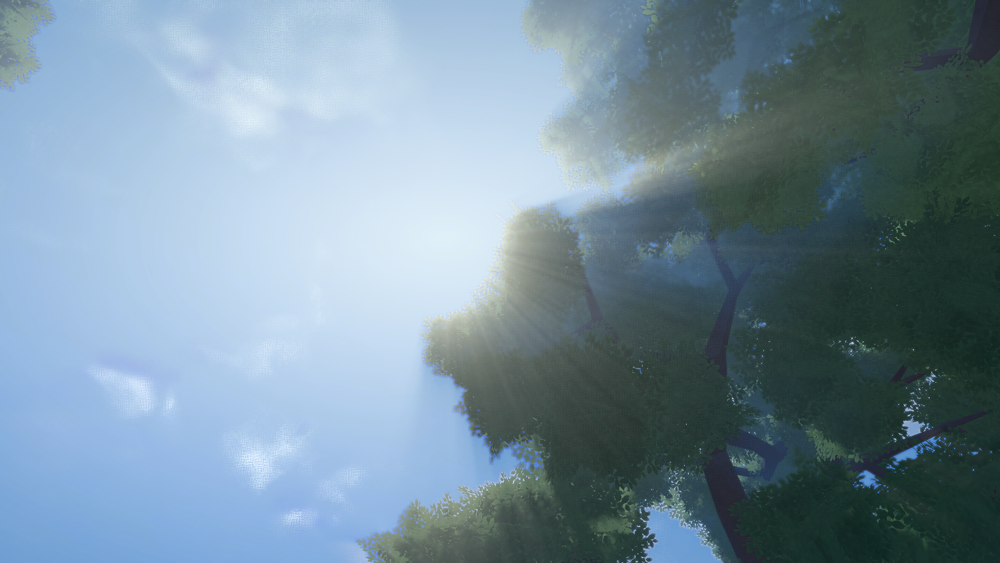

## Water Shader

## Vertex Animated Cloth Shader
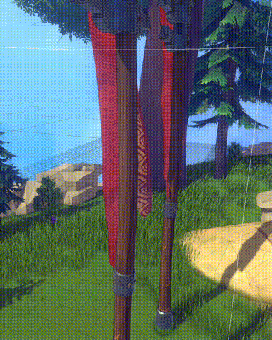

# Tools

TODO: