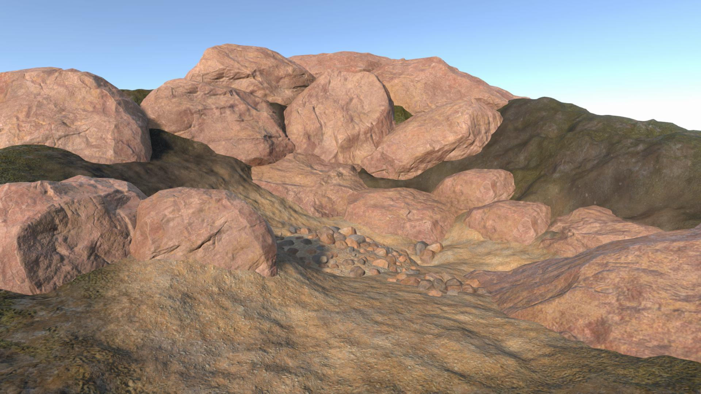

Portfolio
=========

Welcome! I'm a graphics and rendering developer passionate about real-time visual effects, shaders, and global illumination techniques. This portfolio highlights my experiments and open-source projects in Unity URP, HLSL, and advanced rendering.

## Content:
- [About Me](#about-me)
- [Graphics](#graphics)
  - [Global Illumination](#global-illumination)
  - [Terrain](#terrain)

# About Me
I specialize in real-time rendering and visual effects, focusing on Unity’s Universal Render Pipeline (URP) and shader programming in HLSL. I enjoy creating systems that push the boundaries of what can be achieved visually in interactive applications.

# Graphics

## Global Illumination

### Voxel based GI [[Demo](https://x.com/alexmalyutindev/status/1759652466277151195)][[Repo](https://github.com/alexmalyutindev/unity-urp-vxgi)]
A real-time voxel cone tracing solution for URP.

 

### Radiance Cascades GI [[Demo](https://x.com/alexmalyutindev/status/1862402458569359714)][[Repo](https://github.com/alexmalyutindev/unity-urp-radiance-cascades)]
Real-time Radiance Cascade based global illumination solution for URP.

 
 

### PoorGI [[Repo](https://github.com/alexmalyutindev/unity-poor-gi)]
A basic implementation of Screen Space Global Illumination (SSGI) for Unity URP.

---

## Terrain

### ❄️ Interactive snow [[Demo](https://x.com/alexmalyutindev/status/1841541664277475583)]
Simulated interactive snow deformation responding to surface collision.

### 🏔️ Geometry Terrain Blend [[Repo](https://github.com/alexmalyutindev/urp-terrain-blend)]
Seamlessly blends meshes with terrain using screen-space projection and height-based blending.

| Without Terrain Blend                          | With Terrain Blend                         |
|------------------------------------------------|--------------------------------------------|
|  |  |

---

### Terrain Triplanar Mapping & Height-Based Layers Blend [[Demo](https://x.com/alexmalyutindev/status/1859205873580622301)]
Highly optimized triplanar projection for terrain alongside with height-based blending that works with any number of layers.

### Height-Based Terrain Layers Blend
Blends terrain layers smoothly using height maps.

---

### 🌀 Parallax Occlusion Mapping (POM)

#### POM for Geometry

#### POM for Decals [[Demo](https://x.com/alexmalyutindev/status/1845736017568903455)]

 

### 🌿 Foliage Translucency [[Demo](https://x.com/alexmalyutindev/status/1855704297050116353)]
Simulates light scattering through leaves for a natural look.

---

## Lighting

### SunShafts & Volumetric Fog

### Volumetric Fog

### Water 

#### Reflections
#### Volumetric Mud Shadows

### ☁️ 6-Way Lighting Skybox Clouds
**UPDATE PICTURE!**

### Ice Refraction

### Volumetric Clouds

### Vertex Animated Cloth Shader

TODO:

- Foliage Lighting
- Snow Shader
- Imposters
- Volumetric Light Fog

# Tools

*Section under development.*

---

# Contact
- **GitHub**: [alexmalyutindev](https://github.com/alexmalyutindev)
- **Twitter/X**: [@alexmalyutindev](https://x.com/alexmalyutindev)
- **LinkedIn**: [Alexandr Malyutin](https://www.linkedin.com/in/alexmalyutindev/)
