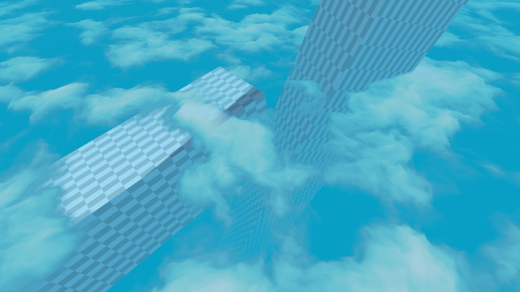

# 🎮 Graphics & Rendering Developer Portfolio

> **Real-time visual effects • Shaders • Global illumination • Unity URP • HLSL**

---

## 👋 About Me

Welcome! I'm a graphics and rendering developer passionate about real-time visual effects, shaders, and global
illumination techniques. This portfolio highlights my experiments and open-source projects in Unity URP, HLSL, and
advanced rendering.

I specialize in real-time rendering and visual effects, focusing on Unity's Universal Render Pipeline (URP) and shader
programming in HLSL. I enjoy creating systems that push the boundaries of what can be achieved visually in interactive
applications.

---

## 📚 Table of Contents

- [Graphics](#graphics)
    - [Global Illumination](#-global-illumination)
    - [Terrain](#%EF%B8%8F-terrain)
    - [Lighting](#%EF%B8%8F-lighting)
    - [Misc](#misc)
- [Code & Tools](#%EF%B8%8F-code--tools)
- [Contact](#-contact)

---

# Graphics

## 🌍 Global Illumination

### 🔆 Radiance Cascades GI

> **Real-time Radiance Cascade based global illumination solution for URP**

**Links:** [📁 Repository](https://github.com/alexmalyutindev/unity-urp-radiance-cascades) • [🎥 Demo Video 1](https://x.com/alexmalyutindev/status/1876262663552176395) • [🎥 Demo Video 2](https://x.com/alexmalyutindev/status/1887600668808257790)

 

### 🧊 Voxel based GI

> **Real-time voxel cone tracing solution for URP**

**Links:** [🎥 Demo](https://x.com/alexmalyutindev/status/1759652466277151195) • [📁 Repository](https://github.com/alexmalyutindev/unity-urp-vxgi)

 

---

### 📺 PoorGI (Screen Space GI)

> **Basic implementation of Screen Space Global Illumination (SSGI) for Unity URP**

**Links:** [📁 Repository](https://github.com/alexmalyutindev/unity-poor-gi)

---

## 🏔️ Terrain

### ❄️ Interactive Snow

> **Simulated interactive snow deformation responding to surface collision**

**Links:** [🎥 Demo](https://x.com/alexmalyutindev/status/1841541664277475583)

---

### 🏞️ Geometry-Terrain Blending

> **Seamlessly blends meshes with terrain using screen-space projection and height-based blending**

**Links:** [📁 Repository](https://github.com/alexmalyutindev/urp-terrain-blend)

|         ❌ Without Terrain Blend         |        ✅ With Terrain Blend         |
|:---------------------------------------:|:-----------------------------------:|
|  |  |

---

### 🗺️ Advanced Terrain Mapping

> **Highly optimized triplanar projection with height-based layer blending**

**Links:** [🎥 Post](https://x.com/alexmalyutindev/status/1859205873580622301)

|             Triplanar Mapping              |         Height-Based Blending         |
|:------------------------------------------:|:-------------------------------------:|
|  |  |

---

## ☀️ Lighting

### ☀️ Sun Shafts / God Rays

> **Crysis-style screen-space sun shafts post-processing effect**

**Links:** [🎥 Demo](https://youtu.be/VdiVuQF2p2k?si=avOAh2tFwUwqt4Iz)

---

### ☁️ 6-Way Lighting Skybox Clouds

> **Skybox clouds with prebaked 6-way lighting for realistic visuals**

---

### 🌿 Foliage Translucency

> **Simulates light scattering through leaves for a natural look**

**Links:** [🎥 Demo](https://x.com/alexmalyutindev/status/1855704297050116353)

---

## Misc

### 🌀 Parallax Occlusion Mapping (POM)

> **Advanced surface detail technique using height maps to create depth illusion without additional geometry**

#### 📦 Geometry POM

#### 🎯 Decals POM

**Links:** [🎥 Demo](https://x.com/alexmalyutindev/status/1845736017568903455)

 

---

### 🌊 Water System

> An advanced real-time water shader featuring Screen-Space Reflections (SSR) and volumetric shadows for enhanced realism.

**Links:** [🎥 Demo](https://x.com/alexmalyutindev/status/1892290284647485745)

https://github.com/user-attachments/assets/9de3770f-b0e7-45c4-8d5b-b0ff8402c5a2

---

### 🧊 Ice Refraction

> Physically inspired shader that simulates light bending and internal scattering in ice, producing realistic translucent surfaces with refraction and depth effects.

---

### ☁️ Volumetric Clouds

> **3D procedural cloud system with realistic lighting and atmospheric perspective**

---

### 🧵 Vertex Animated Cloth Shader

> **GPU-based cloth simulation using vertex shaders for performance-optimized fabric animation**

---

### 🔧 Intel's CMAA2 Port for URP

> **Port of Intel's Conservative Morphological Anti-Aliasing 2.0 for Unity Engine**

**Links:
** [🖼️ Screenshot](https://x.com/alexmalyutindev/status/1928823990933655884) • [📁 Repository](https://github.com/alexmalyutindev/unity-cmaa2)

---

### 🪞 Screen Space Reflection

> **Real-time reflections using screen-space ray marching for accurate surface reflections**

**Links:** [📁 Repository](https://github.com/alexmalyutindev/urp-ssr)

---

### 🌑 Amplify Occlusion Port for URP 14.x.x

> **High-quality screen-space ambient occlusion implementation ported for modern URP versions**

**Links:** [📁 Repository](https://github.com/alexmalyutindev/AmplifyOcclusion)

---

### ☁️ FBM Parallax Clouds

> **Fractal Brownian Motion-based cloud system with parallax projection**

**Links:** [📁 Repository](https://github.com/alexmalyutindev/unity-fbm-clouds)

---

## 🛠️ Code & Tools

### Imposters Baker
> Tool for baking imposters from original models for distant geometry rendering

|  |  |
|:-------------------------------------------:|:-----------------------------------------:|
|         Original Object & Imposter          |       ColorAlpha & NormalDepth Maps       |

### Development Tools
- **Unity Dev Console**: [📁 Repository](https://github.com/alexmalyutindev/unity-dev-console) - In-game debug console
  for Unity development
- **MaliOC Shader Analyzer**: [📁 Repository](https://github.com/alexmalyutindev/unity-malioc-shader-analyzer) -
  Performance analysis tool for mobile GPU shaders

### Upcoming Projects
- **Advanced Snow Shaders** - Enhanced snow deformation and accumulation systems

---

## 📞 Contact

**Let's connect and discuss graphics programming!**

- **🐙 GitHub**: [alexmalyutindev](https://github.com/alexmalyutindev)
- **🐦 Twitter/X**: [@alexmalyutindev](https://x.com/alexmalyutindev)
- **💼 LinkedIn**: [Alexandr Malyutin](https://www.linkedin.com/in/alexmalyutindev/)

---

**⭐ If you find my work interesting, consider starring my repositories!**

*Portfolio last updated: 2025*

