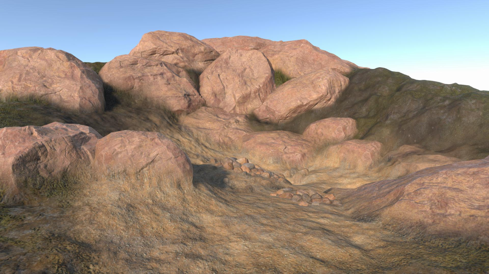
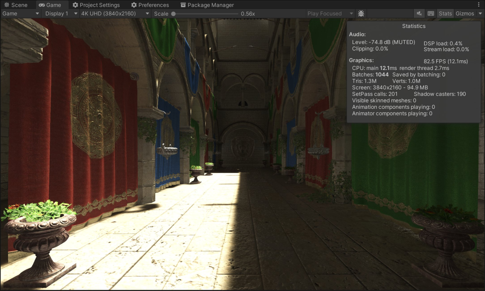

### Hi there, I'm Alex 👋
Senior Unity C# Developer and Graphics Programmer. 

#### 🎨 Porfolio: [link](./PORTFOLIO.md)
  

#### 🔗 Connect with me:
[][twitter]
[][linkedin]
 

[//]: 

___

[twitter]: https://x.com/alexmalyutindev/
[linkedin]: https://www.linkedin.com/in/alexmalyutindev/
