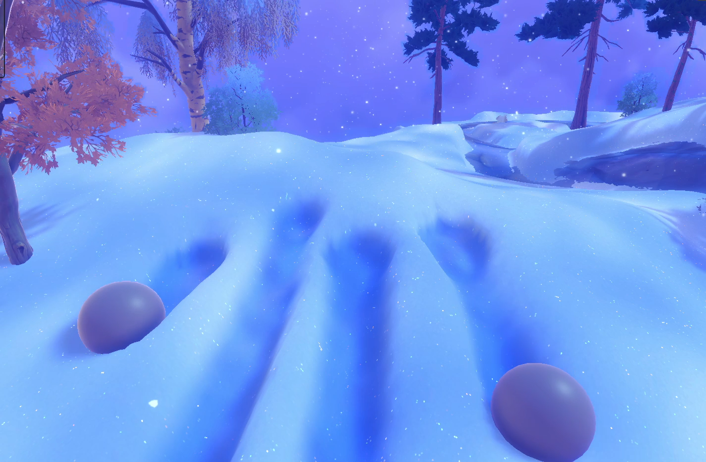
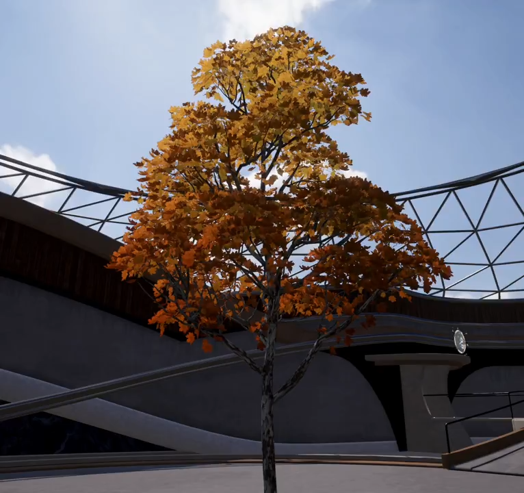
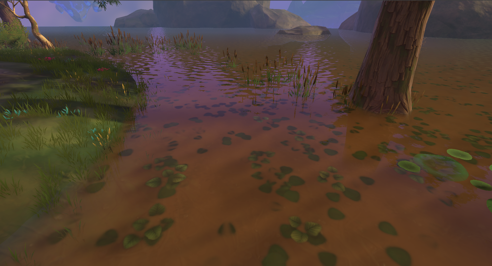
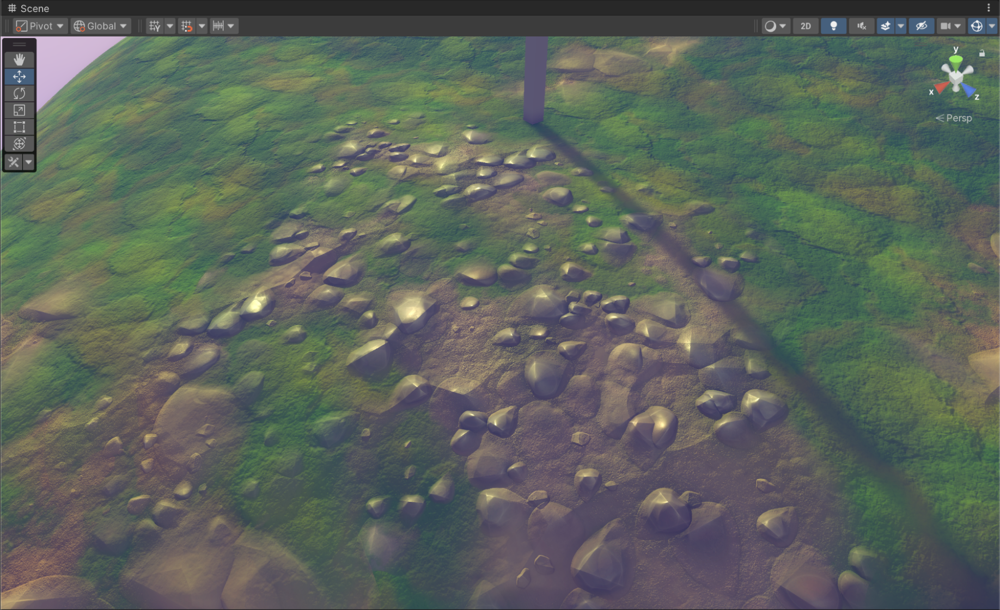

### Hi there, I'm Alex 👋
Senior Unity C# Developer and Graphics Programmer.  

## 📄 CV: [Preview CV](./Graphics%20Programmer%20-%20Alexandr%20Maliutin.pdf)
## 🎨 Portfolio: [View Full Portfolio](./PORTFOLIO.md)

 

 

 

[//]: # ()
[//]: # ()

### 🔗 Connect with me:
[][twitter]
[][linkedin]
 

[//]: 

___

[twitter]: https://x.com/alexmalyutindev/
[linkedin]: https://www.linkedin.com/in/alexmalyutindev/
